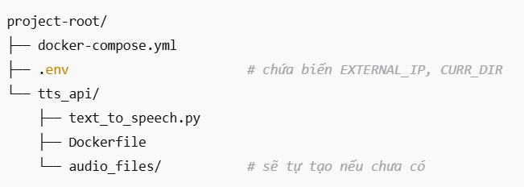
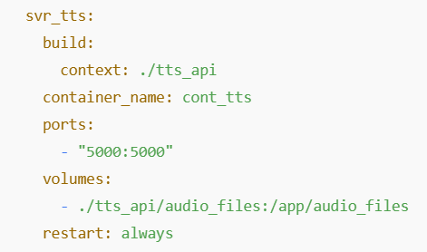
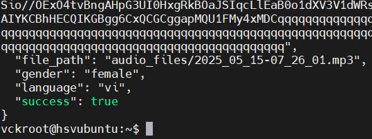
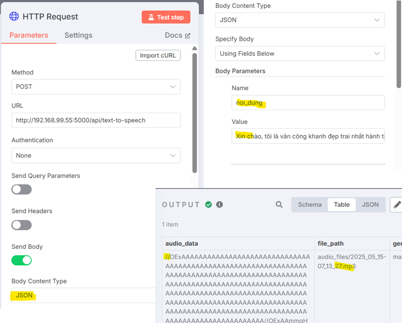

# Text-to-Speech API with Flask + gTTS

Dự án này cung cấp một API REST đơn giản để chuyển đổi văn bản thành giọng nói (MP3) bằng Python Flask và thư viện [gTTS (Google Text-to-Speech)](https://pypi.org/project/gTTS/).

## Tính năng

- Nhận văn bản và ngôn ngữ đầu vào (tiếng Việt, tiếng Anh)
- Trả về file MP3 và nội dung audio dưới dạng Base64
- API đơn giản dễ tích hợp với n8n, webhooks, automation

---

## Cấu trúc thư mục

---

1. Thêm vào cuối file compose.yml

2. Khởi động docker
2. 1 Bằng docker
docker compose up -d --build

2. 2 Chạy trực tiếp bằng Python

cd tts_api
pip install flask gtts
python text_to_speech.py

3. TEST trên local host
curl -X POST http://localhost:5000/api/text-to-speech \
  -H "Content-Type: application/json" \
  -d '{"noi_dung": "Xin chào", "ngon_ngu": "tiếng việt", "giong_doc": "nữ"}'

Kết quả thành công

4. Dùng trên n8n
