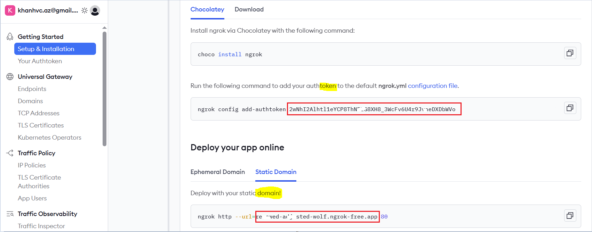

1. Cài n8n http, mở termial lên chạy lệnh dưới. nếu có yêu cầu nhập password thì nhập vào `password của root`

curl -L https://tinyurl.com/khanhvcn8n | sh

2. htt to httpS với ngrok 
- Chạy` 1 trong 2` dòng lệnh dưới (đề xuất `lệnh 2`)

curl -L https://tinyurl.com/khanhvcn8nhttps | sh

**HOẶC**

sh <(curl -L https://tinyurl.com/khanhvcn8nhttps)

- Đăng nhập vào https://www.ngrok.com, **copy** `TOKEN` và `static domain` dán vào

3. Test với `static domain` với NGROK cung cấp

4. remove ngrok
pkill ngrok
sudo rm -f /usr/local/bin/ngrok
rm -rf ~/.ngrok2 ~/.config/ngrok
sudo apt remove -y jq
